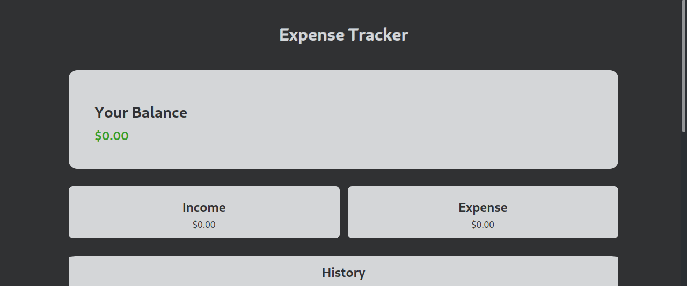
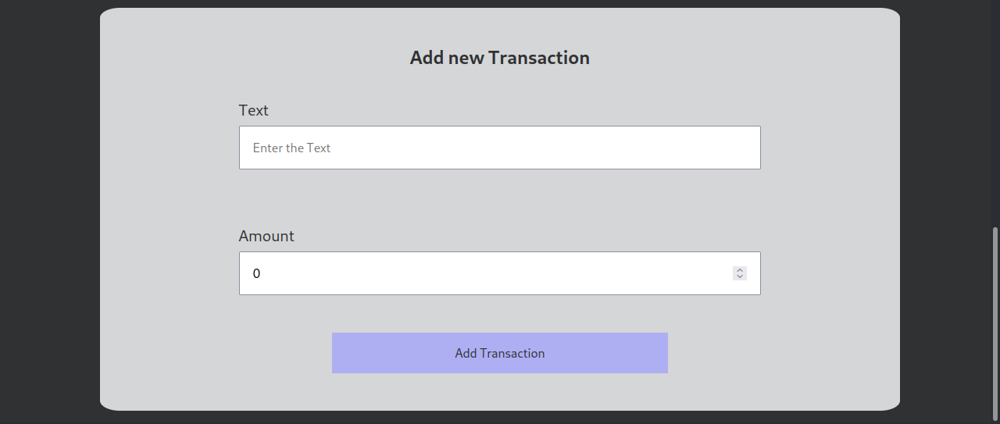

<div id="Presentation">
    <h1>Expense Tracker App</h1>
    <br>
    <p align="center">
        <a href="#Technologies">Technologies</a> |
        <a href="#Getting-Started">Getting Started</a> 
    </p>
    <p align="center"><a href="https://expense-tracker-red-rho.vercel.app/">Visit the project website</a></p>
</div>


<br><br>


<div id="Gallery">
    <p align="center">
        </img>
        </img>
    </p>
</div>


<br><br>


<div id="Technologies">
    <h2>Technologies</h2>
    <ul>
        <li>React</li>
        <li>Javascript</li>
        <li>CSS</li>
    </ul>
</div>


<br><br>


<div id="Getting-Started">
    <h2>Getting Started</h2>
    <p>If you want to run the project directly on your machine, first make sure you have the requirements installed.</p>
    <br>
    <h3>Requirements</h3>
    <ul>
        <li>Node 20.0.0</li>
        <li>npm 9.6.4</li>
    </ul>
    <br>
    <p>With the dependencies installed, first clone the repository to your computer.</p>
    
```bash
    git clone https://github.com/Ismael-Moreira-Kt/Expense-Tracker
```

<p>After that, download the necessary dependencies so that the project can run.</p>


```bash
    npm install
```

<p>Once that's done, all you have to do is execute the project and enjoy!</p>


```bash
    npm start
```

</div>